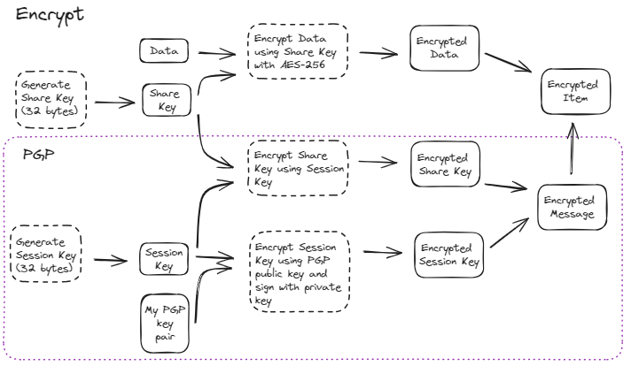
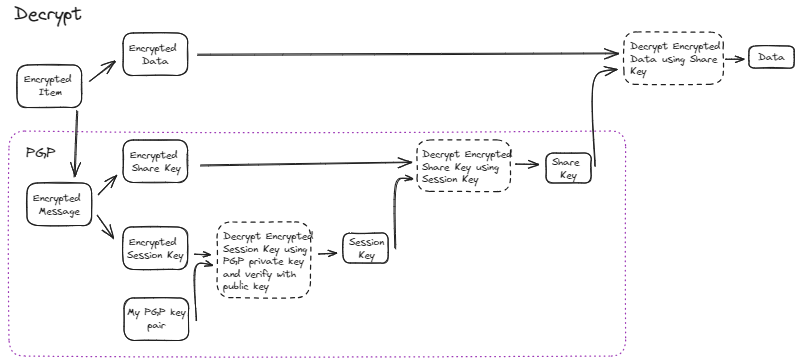
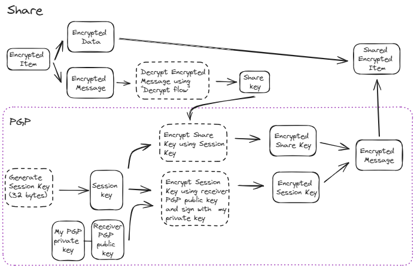
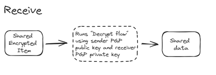

# Open E2EE

## Open-source tools to simplify E2EE on the Web

Inspired by [ProtonMail](https://proton.me/blog/encrypted-email) and [ProtonCalendar](https://proton.me/blog/protoncalendar-security-model) privacy and security practices.

### Libraries used

- [OpenPGP](https://github.com/ProtonMail/openpgpjs)
- [Web Crypto API](https://developer.mozilla.org/en-US/docs/Web/API/Web_Crypto_API)

### Features

#### Included

- Create PGP key pair.
- Export PGP key pair (private key encrypted).
- Create AES-256 keys and encrypt them with PGP public key and sign them with PGP private key.
- Encrypt and decrypt any string using AES-256-GCM.
- Share and receive data encrypted with other's PGP public key and signed with your PGP private key.

#### Next

- File encryption, using a 32-bytes key with AES-256 to encrypt every file chunk and using PGP public key to encrypt the key.
- Share encrypted file, encrypting the 32-bytes key with receiver PGP public key.

### Main flows

#### Encryption flow



#### Decryption flow



#### Share flow



#### Receive flow



## Example

```ts
(async () => {
  const userID = "2997e638-b01b-446f-be33-df9ec8b4f206";
  const passphrase = "passphrase-long-super-long";
  const data = "super secret to encrypt";

  // 1. Create instance of service (2 options)
  // A) Create a new PGP pair. Use only once for each user (e.g: on sign up)
  const etoeeSvc = await new OpenE2EE(userID, passphrase).build();
  // B) Loads an existing PGP pair. Use when user already has a PGP key pair (e.g: on sign in)
  const etoeeSvc = await new OpenE2EE(userID, passphrase).load(
    privateKey,
    publicKey
  );

  // 2. Export PGP keys to save in your database, private key is encrypted by PGP. (e.g: on sign up)
  const { privateKey, publicKey } = await etoeeSvc.exportMasterKeys();

  // 3. Encrypt an item. Save both encryptedKey and encryptedData in your database.
  const { encryptedKey, encryptedData } = await etoeeSvc.encrypt(data);
  console.log({ encryptedKey, encryptedData });

  // 4. Decrypt an item
  const { key, data } = await etoeeSvc.decrypt(encryptedKey, encryptedData);
  console.log({ key, data });

  // 5. Share an E2EE and signed item with another user (receiver)
  const receiverSvc = await new OpenE2EE(
    userID + "other",
    passphrase + "other"
  ).build();
  const { publicKey: receiverPublicKey } = await receiverSvc.exportMasterKeys();
  const { senderPublicKey, receiverEncryptedMessage } = await etoeeSvc.share(
    receiverPublicKey,
    encrypted
  );

  // 6. Receive a E2EE and signed item from another user (sender)
  const { shareKey, data } = await receiverSvc.receive(
    senderPublicKey,
    receiverEncryptedKey,
    encryptedData
  );
  console.log({ shareKey, data, flowRunOk: data === data });
})();
```
